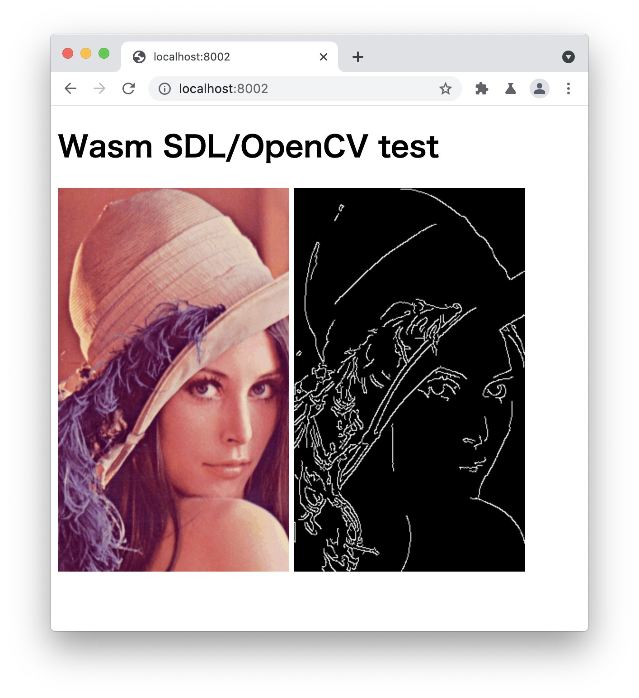

# wasm-sdl-opencv-test

## Prerequisite
You need to have emscripten, and OpenCV installed.

See here to install emscripten:
- https://emscripten.org/docs/getting_started/downloads.html

To build OpenCV with Emscripten, see here:
- https://docs.opencv.org/master/d4/da1/tutorial_js_setup.html

## Build
```
cd build
emcmake cmake -DOpenCV_DIR={WASM_COMPILED_OPENCV_DIR}/build_wasm ..
emmake make
cd ..
```
So, it will generate `build/main.js`.

## Run
```
python3 -m http.server 8002
```
And if you access `http://localhost:8002/`, you will see this:


